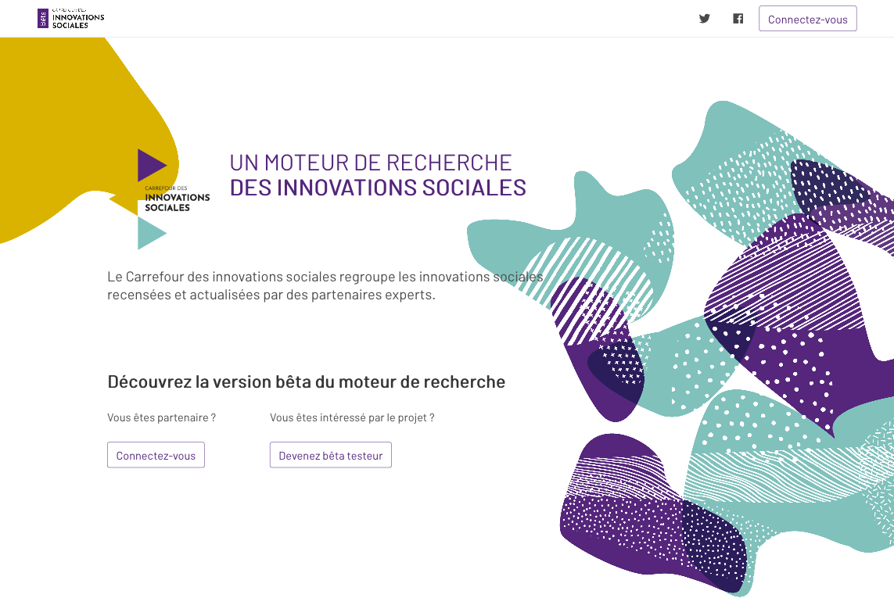
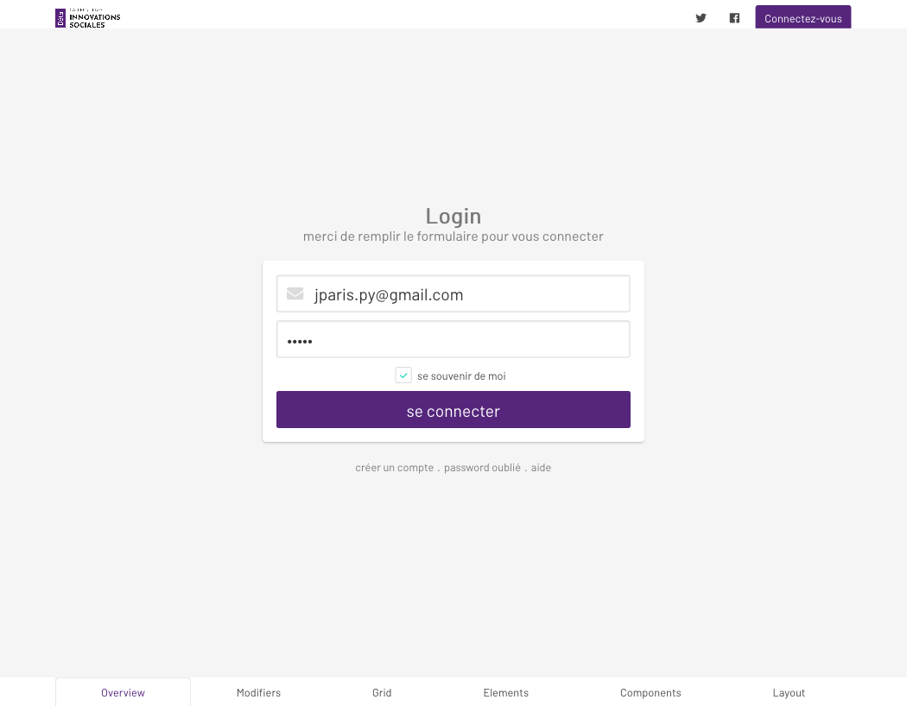
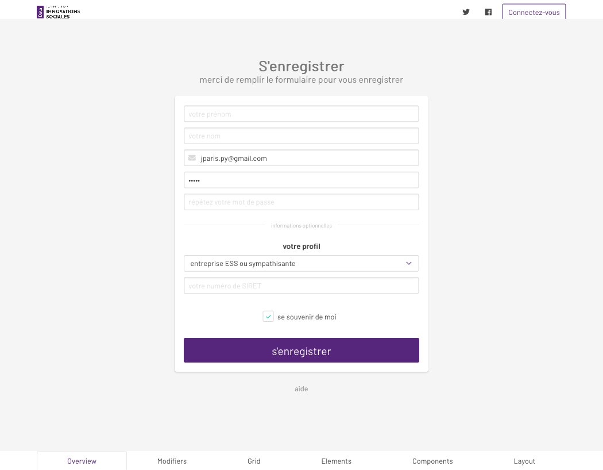
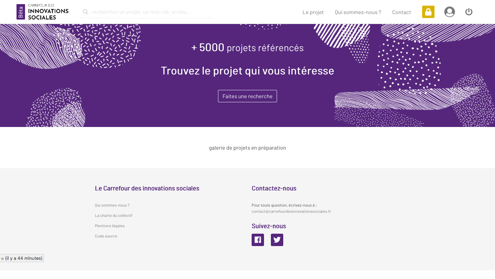
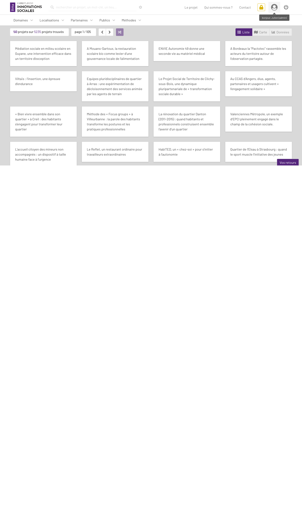

<h1 align=center>  SOCIAL CONNECT <br>-alias-<br> CARREFOUR DES INNOVATIONS SOCIALES </h1>


-------
## PRESENTATION


The official website for the project SocialConnect / aka (in French) Carrefour des Innovations Sociales


-------




-------

## INSTALLATION WALKTHROUGH 

### _LOCALLY_

1. **clone or [download](https://github.com/entrepreneur-interet-general/CIS-front/archive/master.zip) the repo**
1. **[install MongoDB](https://docs.mongodb.com/manual/installation/) locally** or get the URI of the MongoDB you're using
1. **go to your cis folder**
1. **use Python 2**
1. **install python pip and virtualenv**
	
	>
		$ sudo apt install python-pip
		$ sudo apt install virtualenv

1. **install a [virtual environment](https://pypi.python.org/pypi/virtualenv)**
	> 
		$ virtualenv venv
1. **install the libraries**
	> 
		$ sudo pip install -r requirements.txt

1. __if you encounter problems installing the requirements try to install the 'cryptography' library following those steps : [install crypto]__
	> 
		$ pip install cryptography --global-option=build_ext --global-option="-L/usr/local/opt/openssl/lib" --global-option="-I/usr/local/opt/openssl/include"

1. **update the `app/backend/config_secret_vars_example.py` file** with your mongoDB URI (if you're not using default mongoDB connection)

1. **got to your `/cis` folder and run :**
	> 	
		$ python run_cis_front.py --mode=testing

1. **Install Node.js and npm**
1. **Build the front-end**
	
	> 
		$ cd cis/app/frontend
		$ npm install
		$ npm run build

1. (**if you encounter problems while building try this**)
	
	> 
		$ rm -rf cis/app/frontend/node_modules
		$ npm install 
		$ npm run build

1. **check in your browser** at `localhost:8100`


### _PRODUCTION_

1. **get a server** - check digital ocean, OVH, ...
1. optionnal : get a domain name : check OVH, namecheap, godaddy.... + setup DNS
1. **follow (most of) these [instructions](https://github.com/entrepreneur-interet-general/tutos-2018/wiki/Admin-Sys)**
1. **create a `app/backend/config_secret_vars_prod.py` file** based on `config_secret_vars_example.py` structure
1. **go to app folder and create a virtual env** (for instance called "venv")
1. **set up the [gunicorn service](./unit/working_service_config.service) and [NGINX](./nginx/working_nginx_config)** accordingly 
1. ... pray for all that to work as expected, and keep calm... 


### _PRODUCTION_ : update code and deploy

> 
	cd /<your_app_folder>/<username>/app_cis/cis
	git pull origin master
	cd app/frontend
	npm ci
	npm run build
	sudo systemctl restart cis_front


#### Creating the first admin account

Go to `/register`, create an account, then:
```sh
# Connect to MongoDB
mongo
# => mongo shell prompts

# Use cis-front database
use cis_front

# list users
db.users.find()

# get the id of the user you want to move to admin
# abcdef

# Modify user
db.users.updateOne({_id: ObjectId('abcdef')}, {$set: {userAuthLevel: 'admin'}})
```

Then, you can login with your admin user which can change settings of other users 


------

## TECHNICAL POINTS

#### Tech stack
- _Language_ : **Python**... because ... uuh ... eeeh ... I like this language too much ? 
- _Backend_  : **[Flask](http://flask.pocoo.org/)**... minimalistic Python framework
- _Frontend_ : **[Bulma](https://bulma.io/)** as CSS framework, **[Vue.js](https://vuejs.org/)** as JS framework, **[Ajax]()** for API queries (to make queries to [Openscraper](https://github.com/entrepreneur-interet-general/OpenScraper) )
- _Server_   : **[Ubuntu 16.04]()**, **[NGINX](https://www.nginx.com/)**, **[Gunicorn](http://gunicorn.org/)**, hosted in **[Digital Ocean](http://digitalocean.com/)**, domain name from **[OVH](http://ovh.com/)**


-------

## CREDITS 

#### OpenScraper's team thanks :

- the [SocialConnect](https://entrepreneur-interet-general.etalab.gouv.fr/defi/2017/09/26/socialconnect/) project, aka "Carrefour des Innovations Sociales"
- the [EIG](https://entrepreneur-interet-general.etalab.gouv.fr/) program by [Etalab](https://www.etalab.gouv.fr/)
- the [CGET](http://www.cget.gouv.fr/)

#### Contacts - maintainance :

- [Julien Paris](<mailto:julien.paris@cget.gouv.fr>) (aka [JPy](https://twitter.com/jparis_py) on Twitter)

-------

## SCREENSHOTS (development)

<h4 align=center>landing page<br> </h4>


-------

<h4 align=center><br>login</h4>



-------

<h4 align=center><br>register</h4>



-------

<h4 align=center><br>home for connected user </h4>




-------

<h4 align=center><br>search engine for connected user</h4>



-------

<h4 align=center><br>backoffice to manage users</h4>


-------

<h4 align=center><br>backoffice to manage feedbacks</h4>


